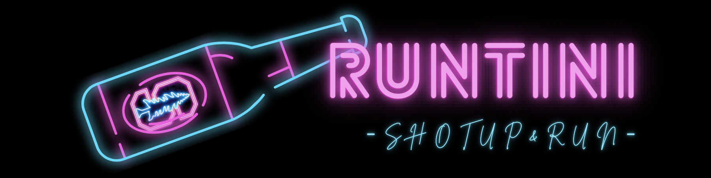
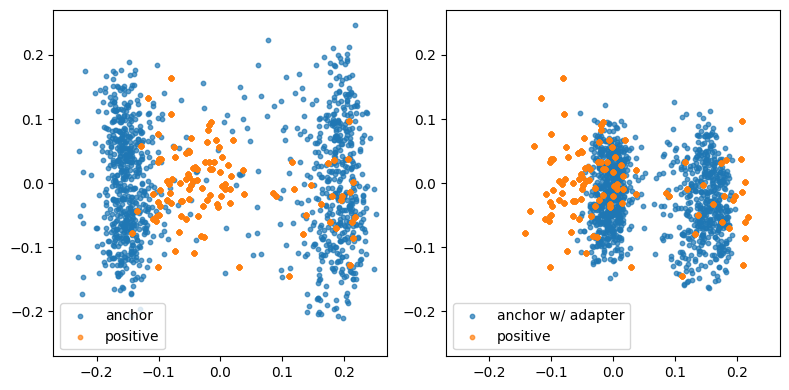

<a id="readme-top"></a>

## Bar Hopping Route Recommender



<div align="center">
Tired of the same old watering holes? Craving a night of diverse vibes and tantalizing tipples?

RunTini redefines nightlife by pairing curated bar experiences with a guided night run. 🍸🏃‍♂️

<b>🔥🔥🔥 Explore the repo and see how we’re turning bar-hopping into a true journey!</b>


</div>

---


---

### Table of Contents

- [About RunTini - Your Night, Your Route](#-about-runtini---your-night-your-route)
    - [How It Works - The Magic Behind the Crawl](#-how-it-works---the-magic-behind-the-crawl)
    - [Built With - The Secret Sauce](#-built-with---the-secret-sauce)
- [Getting Started - How to Unleash the Fun](#-getting-started---how-to-unleash-the-fun)
    - [Prerequisites - What You'll Need in Your Toolkit](#️-prerequisites---what-youll-need-in-your-toolkit)
    - [Installation - Setting Up Your Adventure](#-installation---setting-up-your-adventure)
    - [(Optional) DIY - Local Flavor, Global Fun](#-optional-diy---local-flavor-global-fun)
- [License - Cheers to Open Source](#-license---cheers-to-open-source)
- [Contact - Holler At Us](#-contact---holler-at-us)

<br />

## 🍻 About RunTini - Your Night, Your Route

Tired of scrolling bar reviews, trying to plan the perfect night out? Meet RunTini – your nightlife wingman with a runner’s high. We mix curated bar vibes with a 3 to 5 mile night run, turning your night into a drink-fueled adventure. Whether you’re chasing moody whiskey dens, electric cocktail spots, or beer-soaked pubs, we map out five epic stops and the route to hit them all.

**Run. Sip. Repeat.** This isn’t just bar hopping–it’s bar running. Let’s make your night legendary.

### ✨ How It Works - The Magic Behind the Crawl

Our system orchestrates your perfect bar hop with a blend of advanced AI and geographical wizardry:

* [User Query Analysis]() - Your Wish is Our Command:<br />
You input your desired bar characteristics (e.g., "speakeasy vibe with craft cocktails"). This natural language query is the starting point of our search.

* [Contextual Review Summarization]() - The Vibe Decoder:<br />
We leverage the powerful multimodal model to process and condense extensive user reviews and visual data from Google Maps for numerous bars. This provides nuanced insights into each venue's atmosphere, offerings, and overall experience, going beyond simple ratings.

* [Vector Embedding and Similarity Search]() - Finding Your Tribe:<br />
The summarized review text for each bar is transformed into high-dimensional vector embeddings, capturing the semantic meaning of the bar descriptions to identify bars with the most semantically similar descriptions.

* [Embedding Adaptation]() - The Hit Rate Hero:<br />
To bridge potential vocabulary gaps between user queries and bar reviews, we employ a linear adapter layer attached to the embedding model. This adapter learns a transformation matrix that fine-tunes the query embeddings, specifically improving the hit rate of relevant bars from 56% to **76%**. This is achieved by better aligning the semantic representation of user intent with the embedded bar descriptions, leading to a higher recall in the initial search.

<div align="center">
    
</div>

* [Reranking with Cross-Encoder]() - The Precision Pour:<br />
The initial set of candidate bars undergoes a reranking stage using a more computationally intensive cross-encoder model which directly compares the user query with each candidate bar's full review summary, predicting a relevance score. This step ensures that the top recommendations are not only semantically similar but also highly pertinent to the specific nuances of your request.

* [Hamiltonian Path Optimization]() - The Route Master:<br />
With the top 5 bars selected, we model the bar locations as nodes in a graph and solve the Hamiltonian Path Problem. Our goal is to devise an efficient and enjoyable route that prioritizes a linear progression through different streets, minimizing backtracking and maximizing the exploration of new areas between your chosen bars.

* [Gradio Interface]() - Your Night, Delivered:<br />
Finally, the curated list of 5 bars, along with the optimized bar-hopping route, is presented to you through a user-friendly web interface built with Gradio. This interface allows you to easily view bar details, the suggested route, and embark on your personalized drinking adventure.


### 🧩 Built With - The Secret Sauce

We've concocted RunTini with a potent blend of these amazing technologies:

| Technology                                  | Role                                                                      |
| :------------------------------------------ | :------------------------------------------------------------------------ |
| [](https://ai.google.dev/gemma) | The intelligent core for understanding bar vibes from user reviews and photos. |
| [](https://huggingface.co/ibm-granite/granite-embedding-125m-english) | Transforms summaries into searchable insights, the key to finding your perfect match. |
| [](https://openai.com/gpt-4)                | Powers the generation of natural-sounding user queries, enhancing our search precision. |
| [](https://huggingface.co/BAAI/bge-reranker-v2-m3) | The final touch, ensuring only the top-notch recommendations make it to you.     |

<br />

## 🚀 Getting Started - How to Unleash the Fun

Plan the perfect night out with RunTini — your AI-powered bar-hopping assistant. Follow these steps to get up and running in minutes:

### ⚙️ Prerequisites - What You'll Need in Your Toolkit

Make sure the following are installed on your system:

- **Python 3.8+**
- **Google Chrome** browser
- **ChromeDriver** (ensure it matches your Chrome version)
- *Optional but recommended*: a virtual environment like `venv` or `conda`

### ⚡ Installation - Setting Up Your Adventure

Clone the repository and install all required packages:
```
git clone https://github.com/hsinchen22/Bar-Hopping-Route-Recommender
cd Bar-Hopping-Route-Recommender

pip install -r requirements.txt
```

Start the main app and access the Gradio interface in your browser:
```
python main.py
```
> [!NOTE]
> Gradio will output a local URL (e.g., `http://127.0.0.1:7860`) and a public URL. Open either one to start.

### 🌎 (Optional) DIY - Local Flavor, Global Fun

Want RunTini to work in Seoul, NYC, or your own backyard? Build your dataset:
```
python summary.py
```

> [!IMPORTANT]
> Before running the dataset builder, open `config/default.yml` and input your **City**, **Hugging Face token** and **OpenAI API key** in the appropriate fields.
<br/>

**🎉🎉🎉You're all set! Let RunTini craft your perfect night out — 🍻 cheers to bar-hopping made smart.**

<br/>

## 📜 License - Cheers to Open Source
Distributed under the Unlicense License. See LICENSE.txt for more information. This means you're free to use, modify, and distribute RunTini as you see fit – no strings attached!

<br/>

## 💬 Contact - Holler At Us
Have questions, suggestions, or just want to share your favorite bar crawl story? Feel free to reach out!

<b>Newton Chen</b><br/>
Email: <a href="mailto:hsinchen@stanford.edu">hsinchen@stanford.edu</a><br/>
GitHub: <a href="https://github.com/hsinchen22">github.com/hsinchen22</a>

<b>Justin Yu</b><br/>
Email: <a href="mailto:tiy035@ucsd.edu??">tiy035@ucsd.edu</a><br/>
GitHub: <a href="https://github.com/justinyuyu">github.com/justinyuyu</a>


We look forward to assisting you and ensuring your experience with our product is successful and enjoyable!

<br/>
<a href="#readme-top">Back to top</a>
